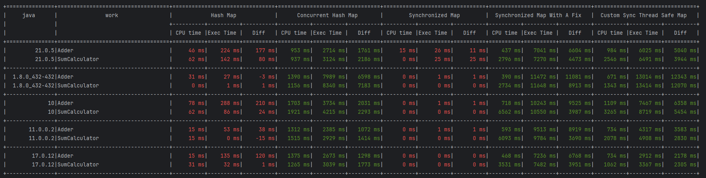

## Task 1 - Das Experiment
Code is Java 6 compatible.

### Test parameters
Tested Implementations:
- HashMap (ConcurrentModificationException)
- ConcurrentHashMap
- Collections.synchronizedMap (ConcurrentModificationException)
- Collections.synchronizedMap With A Fix
- CustomSyncThreadSafeMap

Tested Java: 8, 10, 11, 17, 21

Data size: approx 1GB

Performance assessed as total CPU time vs execution time that have taken the thread to perform the entire job.   

### Implementation notes
- CustomSyncThreadSafeMap includes protection against ConcurrentModificationException based on absolutely horrendous space complexity :-)
- CompletionService is used to run threads to catch
- Performance metrics dumped to csv during each run, all the following runs pick up existing csvs to print aggregated table

### Output from the last run (java 21)
```
============= Hash Map ================
Sum of 0.00% elements calculated: 0
SumCalculator thread exiting. Sums calculated: 1
Caught java.util.ConcurrentModificationException
Adder thread exiting. Elements added: 10.53%
=======================================
======== Concurrent Hash Map ==========
Adder thread exiting. Elements added: 100.00%
Sum of 100.00% elements calculated: 830464496
SumCalculator thread exiting. Sums calculated: 18
=======================================
========= Synchronized Map ============
Sum of 0.00% elements calculated: 1221
SumCalculator thread exiting. Sums calculated: 1
Caught java.util.ConcurrentModificationException
Adder thread exiting. Elements added: 1.23%
=======================================
==== Synchronized Map With A Fix ======
Adder thread exiting. Elements added: 100.00%
Sum of 100.00% elements calculated: 830642752
SumCalculator thread exiting. Sums calculated: 58
=======================================
===== Custom Sync Thread Safe Map =====
Adder thread exiting. Elements added: 100.00%
Sum of 100.00% elements calculated: 830538236
SumCalculator thread exiting. Sums calculated: 22
=======================================


+===============+===================================+================================+================================+================================+================================+================================+
|     java      |               work                |            Hash Map            |      Concurrent Hash Map       |        Synchronized Map        |  Synchronized Map With A Fix   |  Custom Sync Thread Safe Map   |
|               |                                   +----------+----------+----------+----------+----------+----------+----------+----------+----------+----------+----------+----------+----------+----------+----------+
|               |                                   | CPU time |Exec Time |   Diff   | CPU time |Exec Time |   Diff   | CPU time |Exec Time |   Diff   | CPU time |Exec Time |   Diff   | CPU time |Exec Time |   Diff   |
+===============+===================================+==========+==========+==========+==========+==========+==========+==========+==========+==========+==========+==========+==========+==========+==========+==========+
|         21.0.5|Adder                              |     46 ms|    224 ms|    177 ms|    953 ms|   2714 ms|   1761 ms|     15 ms|     26 ms|     11 ms|    437 ms|   7041 ms|   6604 ms|    984 ms|   6025 ms|   5040 ms|
|         21.0.5|SumCalculator                      |     62 ms|    142 ms|     80 ms|    937 ms|   3124 ms|   2186 ms|      0 ms|     25 ms|     25 ms|   2796 ms|   7270 ms|   4473 ms|   2546 ms|   6491 ms|   3944 ms|
+---------------+-----------------------------------+----------+----------+----------+----------+----------+----------+----------+----------+----------+----------+----------+----------+----------+----------+----------+
|  1.8.0_432-432|Adder                              |     31 ms|     27 ms|     -3 ms|   1390 ms|   7989 ms|   6598 ms|      0 ms|      1 ms|      1 ms|    390 ms|  11472 ms|  11081 ms|    671 ms|  13014 ms|  12343 ms|
|  1.8.0_432-432|SumCalculator                      |      0 ms|      1 ms|      1 ms|   1156 ms|   8340 ms|   7183 ms|      0 ms|      0 ms|      0 ms|   2734 ms|  11648 ms|   8913 ms|   1343 ms|  13414 ms|  12070 ms|
+---------------+-----------------------------------+----------+----------+----------+----------+----------+----------+----------+----------+----------+----------+----------+----------+----------+----------+----------+
|             10|Adder                              |     78 ms|    288 ms|    210 ms|   1703 ms|   3734 ms|   2031 ms|      0 ms|      1 ms|      1 ms|    718 ms|  10243 ms|   9525 ms|   1109 ms|   7467 ms|   6358 ms|
|             10|SumCalculator                      |     62 ms|     86 ms|     24 ms|   1921 ms|   4215 ms|   2293 ms|      0 ms|      0 ms|      0 ms|   6562 ms|  10550 ms|   3987 ms|   3265 ms|   8719 ms|   5454 ms|
+---------------+-----------------------------------+----------+----------+----------+----------+----------+----------+----------+----------+----------+----------+----------+----------+----------+----------+----------+
|       11.0.0.2|Adder                              |     15 ms|     53 ms|     38 ms|   1312 ms|   2385 ms|   1072 ms|      0 ms|      1 ms|      1 ms|    593 ms|   9513 ms|   8919 ms|    734 ms|   4317 ms|   3583 ms|
|       11.0.0.2|SumCalculator                      |     15 ms|      0 ms|    -15 ms|   1515 ms|   2929 ms|   1414 ms|      0 ms|      0 ms|      0 ms|   6093 ms|   9784 ms|   3690 ms|   2078 ms|   4908 ms|   2830 ms|
+---------------+-----------------------------------+----------+----------+----------+----------+----------+----------+----------+----------+----------+----------+----------+----------+----------+----------+----------+
|        17.0.12|Adder                              |     15 ms|    135 ms|    120 ms|   1375 ms|   2673 ms|   1298 ms|      0 ms|      0 ms|      0 ms|    468 ms|   7236 ms|   6768 ms|    734 ms|   2912 ms|   2178 ms|
|        17.0.12|SumCalculator                      |     31 ms|     32 ms|      1 ms|   1265 ms|   3039 ms|   1773 ms|      0 ms|      0 ms|      0 ms|   3531 ms|   7482 ms|   3951 ms|   1062 ms|   3367 ms|   2305 ms|
+---------------+-----------------------------------+----------+----------+----------+----------+----------+----------+----------+----------+----------+----------+----------+----------+----------+----------+----------+
```
### Performance results as screenshot
red - failed\
green - succeeded\
Best execution time: ConcurrentHashMap on Java 11/17/21


## Task 2 - Deadlocks
Java 11

### Implementation notes
Implementation guarantees consistent calculations: sum and sqrt are always calculated for the same collection of number.

Deadlocks are avoided by making sure no threads acquire the same set of locks in different order:
- sqrt calculation locks sqrtMutex, then result
- sum calculation locks sumMutex, then result
- int producer locks sqrtMutex, then sumMutex

Completion service is used to stop if one of the threads fails or to initiate shutdown after 60 seconds.
### Output fragment
```
...
Elements: 185260, sum: 832503, Euclidean norm: 2294.89281
Elements: 185353, sum: 832980, Euclidean norm: 2295.59404
Elements: 185486, sum: 833614, Euclidean norm: 2296.51432
Elements: 185564, sum: 833970, Euclidean norm: 2297.03026
Elements: 185704, sum: 834682, Euclidean norm: 2298.06353
Elements: 185866, sum: 835379, Euclidean norm: 2299.03523
Elements: 185917, sum: 835647, Euclidean norm: 2299.42536
Elements: 186141, sum: 836720, Euclidean norm: 2300.91373
Elements: 186566, sum: 838635, Euclidean norm: 2303.52274
Elements: 186578, sum: 838682, Euclidean norm: 2303.59545
Elements: 186695, sum: 839221, Euclidean norm: 2304.32051
Elements: 186974, sum: 840384, Euclidean norm: 2305.85559
Elements: 187306, sum: 841824, Euclidean norm: 2307.74782
Elements: 187886, sum: 844398, Euclidean norm: 2311.27281
Elements: 187988, sum: 844869, Euclidean norm: 2311.94658
Elements: 188100, sum: 845364, Euclidean norm: 2312.65389
Elements: 188879, sum: 848844, Euclidean norm: 2317.40243
Elements: 188937, sum: 849133, Euclidean norm: 2317.80996
Elements: 189043, sum: 849652, Euclidean norm: 2318.54523
Elements: 189083, sum: 849824, Euclidean norm: 2318.76131
Elements: 189187, sum: 850344, Euclidean norm: 2319.49693
Elements: 189206, sum: 850445, Euclidean norm: 2319.63251
Elements: 189305, sum: 850935, Euclidean norm: 2320.32261
...
```

## Task 3 - Where’s Your Bus, Dude?
Java 11

### Implementation notes
Implementation supports multiple producers/consumers each producing/consuming messages on multiple topics. Messages can have multiple topics as well. After message is consumed by all registered consumers it gets deleted from the bus.

Producers are started with 100 ms delay. Each producer produces 10 messages with a random subset of topics at random intervals from 100 to 5000 ms and then exits. Application stops once all producers are done.

Stats how many messages per topic were produced and consumed are printed at the end.

### Test run
10 topics, 3 producers, 5 consumer - such modest numbers were used for the sake or generating a reasonably sized output, can be easily extended. Each consumer has up to 5 random topics assigned.

### Output beginning (fragment)
```
03:44:09.415 [main] INFO  com.epam.task3.App - Consumer_0 created for [Mangoes]
03:44:09.430 [main] INFO  com.epam.task3.App - Consumer_1 created for [Strawberries, Oranges]
03:44:09.431 [main] INFO  com.epam.task3.App - Consumer_2 created for [Pineapples]
03:44:09.432 [main] INFO  com.epam.task3.App - Consumer_3 created for [Bananas, Pears, Pineapples]
03:44:09.432 [main] INFO  com.epam.task3.App - Consumer_4 created for [Grapes, Pineapples, Apples, Strawberries]
03:44:12.340 [pool-1-thread-4] INFO  com.epam.task3.bus.MessageConsumer - Consumer_3 [Bananas, Pears, Pineapples] received from Producer_0 sent to [Pears]: Hello from 'Producer_0' number 0_
03:44:12.432 [pool-1-thread-2] INFO  com.epam.task3.bus.MessageConsumer - Consumer_1 [Strawberries, Oranges] received from Producer_1 sent to [Strawberries]: Hello from 'Producer_1' number 0_
03:44:12.433 [pool-1-thread-5] INFO  com.epam.task3.bus.MessageConsumer - Consumer_4 [Grapes, Pineapples, Apples, Strawberries] received from Producer_1 sent to [Strawberries]: Hello from 'Producer_1' number 0_
03:44:12.530 [pool-1-thread-5] INFO  com.epam.task3.bus.MessageConsumer - Consumer_4 [Grapes, Pineapples, Apples, Strawberries] received from Producer_2 sent to [Strawberries]: Hello from 'Producer_2' number 0_
03:44:12.531 [pool-1-thread-2] INFO  com.epam.task3.bus.MessageConsumer - Consumer_1 [Strawberries, Oranges] received from Producer_2 sent to [Strawberries]: Hello from 'Producer_2' number 0_
03:44:14.345 [pool-1-thread-4] INFO  com.epam.task3.bus.MessageConsumer - Consumer_3 [Bananas, Pears, Pineapples] received from Producer_1 sent to [Pears]: Hello from 'Producer_1' number 1_
03:44:14.444 [pool-1-thread-5] INFO  com.epam.task3.bus.MessageConsumer - Consumer_4 [Grapes, Pineapples, Apples, Strawberries] received from Producer_2 sent to [Grapes]: Hello from 'Producer_2' number 1_
03:44:18.590 [pool-1-thread-2] INFO  com.epam.task3.bus.MessageConsumer - Consumer_1 [Strawberries, Oranges] received from Producer_0 sent to [Oranges, Peaches]: Hello from 'Producer_0' number 2_
03:44:18.680 [pool-1-thread-2] INFO  com.epam.task3.bus.MessageConsumer - Consumer_1 [Strawberries, Oranges] received from Producer_1 sent to [Strawberries, Peaches]: Hello from 'Producer_1' number 2_
03:44:18.680 [pool-1-thread-5] INFO  com.epam.task3.bus.MessageConsumer - Consumer_4 [Grapes, Pineapples, Apples, Strawberries] received from Producer_1 sent to [Strawberries, Peaches]: Hello from 'Producer_1' number 2_
03:44:18.780 [pool-1-thread-2] INFO  com.epam.task3.bus.MessageConsumer - Consumer_1 [Strawberries, Oranges] received from Producer_2 sent to [Pineapples, Strawberries]: Hello from 'Producer_2' number 2_
03:44:18.780 [pool-1-thread-3] INFO  com.epam.task3.bus.MessageConsumer - Consumer_2 [Pineapples] received from Producer_2 sent to [Pineapples, Strawberries]: Hello from 'Producer_2' number 2_
03:44:18.780 [pool-1-thread-5] INFO  com.epam.task3.bus.MessageConsumer - Consumer_4 [Grapes, Pineapples, Apples, Strawberries] received from Producer_2 sent to [Pineapples, Strawberries]: Hello from 'Producer_2' number 2_
03:44:18.780 [pool-1-thread-4] INFO  com.epam.task3.bus.MessageConsumer - Consumer_3 [Bananas, Pears, Pineapples] received from Producer_2 sent to [Pineapples, Strawberries]: Hello from 'Producer_2' number 2_
03:44:22.463 [pool-1-thread-2] INFO  com.epam.task3.bus.MessageConsumer - Consumer_1 [Strawberries, Oranges] received from Producer_0 sent to [Pears, Oranges]: Hello from 'Producer_0' number 3_
03:44:22.463 [pool-1-thread-4] INFO  com.epam.task3.bus.MessageConsumer - Consumer_3 [Bananas, Pears, Pineapples] received from Producer_0 sent to [Pears, Oranges]: Hello from 'Producer_0' number 3_
03:44:22.554 [pool-1-thread-1] INFO  com.epam.task3.bus.MessageConsumer - Consumer_0 [Mangoes] received from Producer_1 sent to [Mangoes, Pineapples]: Hello from 'Producer_1' number 3_
```

### Output end (stats)
```
03:44:32.671 [main] INFO  com.epam.task3.App - 
+--------------+--------------------------------------------+--------------------------------------------------------------------------+
|              |                  Produced                  |                                 Consumed                                 |
+--------------+--------------+--------------+--------------+--------------+--------------+--------------+--------------+--------------+
|    Topic     |  Producer_0  |  Producer_1  |  Producer_2  |  Consumer_0  |  Consumer_1  |  Consumer_2  |  Consumer_3  |  Consumer_4  |
+--------------+--------------+--------------+--------------+--------------+--------------+--------------+--------------+--------------+
|    Apples    |             1|             1|             1|      -       |      -       |      -       |      -       |             3|
+--------------+--------------+--------------+--------------+--------------+--------------+--------------+--------------+--------------+
|   Oranges    |             2|             0|             1|      -       |             3|      -       |      -       |      -       |
+--------------+--------------+--------------+--------------+--------------+--------------+--------------+--------------+--------------+
|   Bananas    |             1|             1|             0|      -       |      -       |      -       |             2|      -       |
+--------------+--------------+--------------+--------------+--------------+--------------+--------------+--------------+--------------+
|    Grapes    |             3|             1|             2|      -       |      -       |      -       |      -       |             6|
+--------------+--------------+--------------+--------------+--------------+--------------+--------------+--------------+--------------+
| Strawberries |             0|             3|             3|      -       |             6|      -       |      -       |             6|
+--------------+--------------+--------------+--------------+--------------+--------------+--------------+--------------+--------------+
|   Mangoes    |             0|             1|             1|             2|      -       |      -       |      -       |      -       |
+--------------+--------------+--------------+--------------+--------------+--------------+--------------+--------------+--------------+
| Watermelons  |             2|             1|             0|      -       |      -       |      -       |      -       |      -       |
+--------------+--------------+--------------+--------------+--------------+--------------+--------------+--------------+--------------+
|  Pineapples  |             1|             2|             4|      -       |      -       |             7|             7|             7|
+--------------+--------------+--------------+--------------+--------------+--------------+--------------+--------------+--------------+
|   Peaches    |             2|             3|             2|      -       |      -       |      -       |      -       |      -       |
+--------------+--------------+--------------+--------------+--------------+--------------+--------------+--------------+--------------+
|    Pears     |             3|             2|             1|      -       |      -       |      -       |             6|      -       |
+--------------+--------------+--------------+--------------+--------------+--------------+--------------+--------------+--------------+
```

### Full logs 
[[INFO] - consumers](./message-bus-log-info.log)\
[[DEBUG] - consumers + producers](./message-bus-log-debug.log)\
[[TRACE] - consumers + producers + bus queue size](./message-bus-log-trace.log)


## Task 4 - Object Pool
Java 11

### Implementation notes

Pool implementation has limited capacity and uses wait/notify for blocking operations.

To demo pool functionality the app starts threads continuously getting/taking objects to the pull with random intervals of 200-300 ms. The threads are started in `N=15` iterations, with `N-i` producers and `i` consumers started each iteration with a small 40 ms delay in-between. Each thread runs for 16 seconds then exits.\
This creates a workflow where in the beginning there are more `take/produce`-threads, than `get/consume`-threads, then the balance shifts with fewer `take/produce`-threads and more `get/consume`-threads started every iteration and threads exiting after 16 seconds.\
The `get`/`take` timings are measured within every thread and a scheduled executor is used to print average timings every second.

### Output
```
10:33:24.294 [pool-2-thread-1] INFO com.epam.task4.App --  24 producers,   0 consumers, average 'take' time:   163 ms, average 'get' time:    -    
10:33:25.269 [pool-2-thread-1] INFO com.epam.task4.App --  45 producers,   3 consumers, average 'take' time:   661 ms, average 'get' time:    66 ms
10:33:26.269 [pool-2-thread-1] INFO com.epam.task4.App --  65 producers,   8 consumers, average 'take' time:   908 ms, average 'get' time:    26 ms
10:33:27.268 [pool-2-thread-1] INFO com.epam.task4.App --  83 producers,  15 consumers, average 'take' time:   990 ms, average 'get' time:    32 ms
10:33:28.269 [pool-2-thread-1] INFO com.epam.task4.App --  94 producers,  28 consumers, average 'take' time:   945 ms, average 'get' time:    24 ms
10:33:29.269 [pool-2-thread-1] INFO com.epam.task4.App -- 105 producers,  42 consumers, average 'take' time:   892 ms, average 'get' time:    21 ms
10:33:30.269 [pool-2-thread-1] INFO com.epam.task4.App -- 114 producers,  58 consumers, average 'take' time:   914 ms, average 'get' time:    26 ms
10:33:31.271 [pool-2-thread-1] INFO com.epam.task4.App -- 119 producers,  78 consumers, average 'take' time:   688 ms, average 'get' time:    23 ms
10:33:32.268 [pool-2-thread-1] INFO com.epam.task4.App -- 120 producers, 101 consumers, average 'take' time:   498 ms, average 'get' time:    23 ms
10:33:33.269 [pool-2-thread-1] INFO com.epam.task4.App -- 120 producers, 120 consumers, average 'take' time:   259 ms, average 'get' time:    23 ms
10:33:34.270 [pool-2-thread-1] INFO com.epam.task4.App -- 120 producers, 120 consumers, average 'take' time:    70 ms, average 'get' time:    23 ms
10:33:35.269 [pool-2-thread-1] INFO com.epam.task4.App -- 120 producers, 120 consumers, average 'take' time:    55 ms, average 'get' time:    21 ms
10:33:36.269 [pool-2-thread-1] INFO com.epam.task4.App -- 120 producers, 120 consumers, average 'take' time:    56 ms, average 'get' time:    22 ms
10:33:37.271 [pool-2-thread-1] INFO com.epam.task4.App -- 120 producers, 120 consumers, average 'take' time:    50 ms, average 'get' time:    22 ms
10:33:38.270 [pool-2-thread-1] INFO com.epam.task4.App -- 120 producers, 120 consumers, average 'take' time:    56 ms, average 'get' time:    20 ms
10:33:39.269 [pool-2-thread-1] INFO com.epam.task4.App -- 120 producers, 120 consumers, average 'take' time:    48 ms, average 'get' time:    20 ms
10:33:40.269 [pool-2-thread-1] INFO com.epam.task4.App -- 101 producers, 120 consumers, average 'take' time:    39 ms, average 'get' time:    25 ms
10:33:41.269 [pool-2-thread-1] INFO com.epam.task4.App --  78 producers, 119 consumers, average 'take' time:    19 ms, average 'get' time:    66 ms
10:33:42.270 [pool-2-thread-1] INFO com.epam.task4.App --  56 producers, 115 consumers, average 'take' time:    20 ms, average 'get' time:   130 ms
10:33:43.268 [pool-2-thread-1] INFO com.epam.task4.App --  42 producers, 110 consumers, average 'take' time:    24 ms, average 'get' time:   241 ms
10:33:44.269 [pool-2-thread-1] INFO com.epam.task4.App --  28 producers, 106 consumers, average 'take' time:    18 ms, average 'get' time:   317 ms
10:33:45.269 [pool-2-thread-1] INFO com.epam.task4.App --  15 producers,  98 consumers, average 'take' time:    17 ms, average 'get' time:   449 ms
10:33:46.270 [pool-2-thread-1] INFO com.epam.task4.App --   7 producers,  94 consumers, average 'take' time:    21 ms, average 'get' time:   606 ms
10:33:47.269 [pool-2-thread-1] INFO com.epam.task4.App --   3 producers,  92 consumers, average 'take' time:    17 ms, average 'get' time:   754 ms
10:33:48.284 [pool-2-thread-1] INFO com.epam.task4.App --   0 producers,  92 consumers, average 'take' time:    -    , average 'get' time:   923 ms
10:33:49.276 [pool-2-thread-1] INFO com.epam.task4.App --   0 producers,  92 consumers, average 'take' time:    -    , average 'get' time:  1091 ms
10:33:50.276 [pool-2-thread-1] INFO com.epam.task4.App --   0 producers,  92 consumers, average 'take' time:    -    , average 'get' time:  1261 ms
10:33:51.271 [pool-2-thread-1] INFO com.epam.task4.App --   0 producers,  92 consumers, average 'take' time:    -    , average 'get' time:  1430 ms
10:33:52.277 [pool-2-thread-1] INFO com.epam.task4.App --   0 producers,  92 consumers, average 'take' time:    -    , average 'get' time:  1600 ms
10:33:52.991 [main] DEBUG com.epam.task4.App -- Shut down
```

## Task 5 - Currency Exchange App
Java 11

### Implementation notes
Two types of operations are used:
- exchange rate operations (set, get, convert)
- bank account operations (open/delete/close account, deposit, withdraw/withdrawAll, exchange, transfer);

Exchange rate operations are carried out by `CurrencyExchangeService`.\
Bank account operations are performed by `BankingService`, that uses `AccountService` to access/manage accounts and `CurrencyExchangeService` for funds movement operations.

Exchange rate operations use read/write locks for synchronization - each currency exchange rate has its own lock.\
Account operations are synchronized with a "named lock" concept implementation, so that multiple threads can work on different accounts in parallel, but no 2 or more threads can work on the same account.

The time threads have to wait for account/exchange rate locks is tracked and reported.

Account files are stored in `data` directory

### Test Run Conditions

Testing workflow starts N threads that continuously perform operations with no delay. Operations and parameters are chosen randomly but with predefined probability. Some operations are generated with invalid/illegal parameters to simulate exceptional use-cases. 

Initial list of currency exchange pairs is predefined and includes 5 currencies and 16 exchange rates (4 exchange rates are missing to simulate exceptional use-cases).

The number of active accounts is limited to 5 to force the contention between threads.

App runs for 10 seconds then quits, printing the following stats:
- Avg account wait time: how long on average a thread had to wait to acquire an account lock 
- Avg exchange rate write wait time: how long on average a thread had to wait to acquire an exchange rate write lock
- Write was locked by another thread: how many times a thread had to wait for another thread to release an exchange rate write lock 
- Avg exchange rate read wait time: how long on average a thread had to wait to acquire an exchange rate read lock
- Read was locked by another thread: how many times a thread had to wait for another thread to release an exchange rate read lock
- Avg action count performed by a thread: how many actions on average a thread managed to perform in 10s run time

### Logging Levels

#### INFO
Only messages from worker threads POV - actions, before/after account balances, encountered errors.

Example:
```
...
12:27:15.935 [pool-1-thread-3] ERROR com.epam.task5.App$Worker - Encountered exception: com.epam.task5.model.IllegalAmountException: amount is not positive: 0.00
12:27:15.936 [pool-1-thread-3] INFO  com.epam.task5.App$Worker - Setting GBP/GBP exchange rate to 1.000535131066569
12:27:15.936 [pool-1-thread-3] ERROR com.epam.task5.App$Worker - Encountered exception: com.epam.task5.service.IllegalExchangeRateException: same currency: GBP
12:27:15.936 [pool-1-thread-3] INFO  com.epam.task5.App$Worker - Transferring 5553.0€ from 08711b6c-0fc2-4cf0-aa68-7c852a4ac183 to 04821cd7-cc4d-424c-a4df-9ebf588fb9c9
12:27:15.937 [pool-1-thread-1] ERROR com.epam.task5.App$Worker - Encountered exception: com.epam.task5.service.ExchangeRateNotFoundException: PLN -> JPY
12:27:15.937 [pool-1-thread-1] INFO  com.epam.task5.App$Worker - Withdrawing all funds from account a8af1f94-dc19-4ca5-8aab-485f9d8d23e9
12:27:15.938 [pool-1-thread-3] INFO  com.epam.task5.App$Worker - 
======================================================================================================================================================
	Account: 08711b6c-0fc2-4cf0-aa68-7c852a4ac183 (JPY)
	Date: 12/11/24, 12:27 PM
	Balance:
	+----------+--------------------+
	| Currency |      Balance       |
	+----------+--------------------+
	|JPY       |         1357087.284|
	|EUR       |          352971.294|
	|GBP       |             111.004|
	|USD       |               4.220|
	+----------+--------------------+
======================================================================================================================================================
...
```

#### DEBUG
Messages from worker threads POV + service layer.

Example:
```
...
12:27:15.934 [pool-1-thread-3] DEBUG c.epam.task5.persistence.AccountDao - Getting account 7139a2f5-4940-4fb4-9387-8ecfc590775e
12:27:15.935 [pool-1-thread-3] DEBUG c.epam.task5.persistence.AccountDao - Reading from 7139a2f5-4940-4fb4-9387-8ecfc590775e.acc
12:27:15.935 [pool-1-thread-3] DEBUG c.epam.task5.service.BankingService - Depositing 0.00¥ to 7139a2f5-4940-4fb4-9387-8ecfc590775e
12:27:15.935 [pool-1-thread-4] DEBUG c.epam.task5.service.BankingService - Depositing 96865.9¥ to a8af1f94-dc19-4ca5-8aab-485f9d8d23e9
12:27:15.935 [pool-1-thread-4] DEBUG c.epam.task5.service.AccountService - Updating account Account(id=a8af1f94-dc19-4ca5-8aab-485f9d8d23e9, mainCurrency=EUR)
12:27:15.935 [pool-1-thread-4] DEBUG c.epam.task5.persistence.AccountDao - Saving account Account(id=a8af1f94-dc19-4ca5-8aab-485f9d8d23e9, mainCurrency=EUR)
12:27:15.935 [pool-1-thread-3] ERROR com.epam.task5.App$Worker - Encountered exception: com.epam.task5.model.IllegalAmountException: amount is not positive: 0.00
12:27:15.936 [pool-1-thread-3] INFO  com.epam.task5.App$Worker - Setting GBP/GBP exchange rate to 1.000535131066569
12:27:15.936 [pool-1-thread-3] ERROR com.epam.task5.App$Worker - Encountered exception: com.epam.task5.service.IllegalExchangeRateException: same currency: GBP
12:27:15.936 [pool-1-thread-4] DEBUG c.epam.task5.persistence.AccountDao - Writing to a8af1f94-dc19-4ca5-8aab-485f9d8d23e9.acc
12:27:15.936 [pool-1-thread-3] INFO  com.epam.task5.App$Worker - Transferring 5553.0€ from 08711b6c-0fc2-4cf0-aa68-7c852a4ac183 to 04821cd7-cc4d-424c-a4df-9ebf588fb9c9
12:27:15.937 [pool-1-thread-1] DEBUG c.e.t.s.CurrencyExchangeService - Converting 9.4 from PLN to JPY with rate null
12:27:15.937 [pool-1-thread-1] ERROR com.epam.task5.App$Worker - Encountered exception: com.epam.task5.service.ExchangeRateNotFoundException: PLN -> JPY
12:27:15.937 [pool-1-thread-3] DEBUG c.epam.task5.service.BankingService - Building 08711b6c-0fc2-4cf0-aa68-7c852a4ac183 account statement
...
```

#### TRACE
Messages from worker threads POV + service layer + lock wait times.

Example:
```
12:27:15.936 [pool-1-thread-3] INFO  com.epam.task5.App$Worker - Transferring 5553.0€ from 08711b6c-0fc2-4cf0-aa68-7c852a4ac183 to 04821cd7-cc4d-424c-a4df-9ebf588fb9c9
12:27:15.937 [pool-1-thread-1] TRACE c.e.t.s.CurrencyExchangeService - read lock for CurrencyExchange(ccy1=PLN, ccy2=JPY) acquired in 800 ns
12:27:15.937 [pool-1-thread-1] DEBUG c.e.t.s.CurrencyExchangeService - Converting 9.4 from PLN to JPY with rate null
12:27:15.937 [pool-1-thread-1] TRACE c.e.t.s.CurrencyExchangeService - read lock for CurrencyExchange(ccy1=PLN, ccy2=JPY) released after 116600 ns
12:27:15.937 [pool-1-thread-1] TRACE c.epam.task5.service.BankingService - lock for 08711b6c-0fc2-4cf0-aa68-7c852a4ac183 released after 7569600 ns
12:27:15.937 [pool-1-thread-1] ERROR com.epam.task5.App$Worker - Encountered exception: com.epam.task5.service.ExchangeRateNotFoundException: PLN -> JPY
12:27:15.937 [pool-1-thread-3] TRACE c.epam.task5.service.BankingService - lock for 08711b6c-0fc2-4cf0-aa68-7c852a4ac183 acquired in 1250500 ns, wait time 1243000 ns
```

### Output
#### 10 threads 
Stats:
```
12:27:15.959 [main] INFO  com.epam.task5.App - Pool shut down
12:27:15.967 [main] INFO  com.epam.task5.App - Avg account wait time 6.188 ms
12:27:15.969 [main] INFO  com.epam.task5.App - Avg exchange rate write wait time 0.031 ms
12:27:15.969 [main] INFO  com.epam.task5.App - Write was locked by another thread 2 times
12:27:15.969 [main] INFO  com.epam.task5.App - Avg exchange rate read wait time 0.002 ms
12:27:15.969 [main] INFO  com.epam.task5.App - Read was locked by another thread 1 times
12:27:15.973 [main] INFO  com.epam.task5.App - Avg action count performed by a thread 541.200
```

Logs:
- [info](10_ccy-exchange-log-info.log)
- [debug](10_ccy-exchange-log-debug.log)
- [trace](10_ccy-exchange-log-trace.log)

'not enough accounts' messages in the beginning are normal - as the actions are picked randomly, it takes time for the first account to open 

#### 1000 threads

Yes, 1000 threads hammering 5 accounts.

Stats:
```
12:42:49.027 [main] INFO  com.epam.task5.App - Pool shut down
12:42:49.037 [main] INFO  com.epam.task5.App - Avg account wait time 237.417 ms
12:42:49.039 [main] INFO  com.epam.task5.App - Avg exchange rate write wait time 84.625 ms
12:42:49.039 [main] INFO  com.epam.task5.App - Write was locked by another thread 804 times
12:42:49.041 [main] INFO  com.epam.task5.App - Avg exchange rate read wait time 17.747 ms
12:42:49.041 [main] INFO  com.epam.task5.App - Read was locked by another thread 728 times
12:42:49.045 [main] INFO  com.epam.task5.App - Avg action count performed by a thread 19.128
```

Logs:
- [info](1000_ccy-exchange-log-info.log)
- [debug](1000_ccy-exchange-log-debug.log)
- [trace](1000_ccy-exchange-log-trace.log)

'not enough accounts' messages in the beginning are normal - as the actions are picked randomly, it takes time for the first account to open